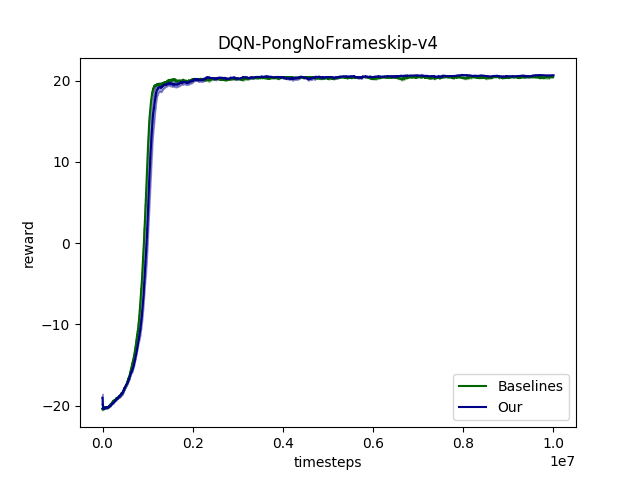
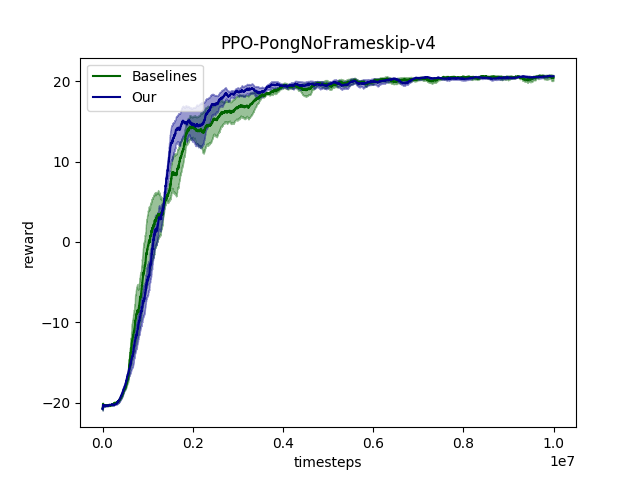
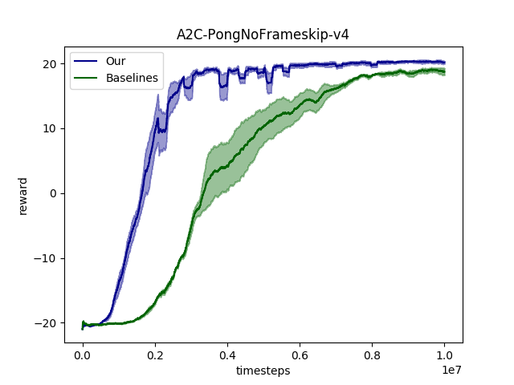
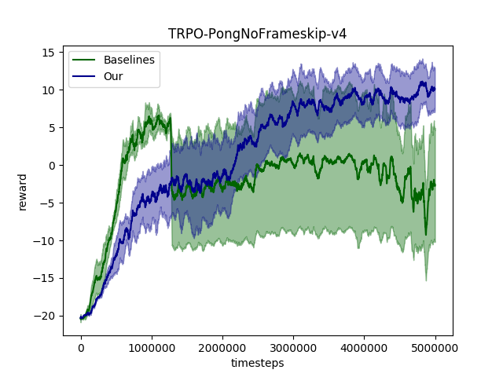

# RL-Experiments

RL-Experiments aims to modify and compare deep RL algorithms in single machine easily. 
For distributed training, I highly recommend [ray](https://github.com/ray-project/ray).

The codes refer to [openai/baselines](https://github.com/openai/baselines) mostly but 
are implemented by PyTorch. We also highlight the differences between implementation and paper 
which can be found by searching `highlight` in codes.


# Comparasion with openai/baselines

With the same default parameters in [openai/baselines](https://github.com/openai/baselines), 
the performance and FPS averaging three random seeds on Pong are illustrated as follows.  

    

    

    

    


| | DQN | PPO | A2C | TRPO|
|---|---|---|---|----|
| Our | 260 | 1615 | 1700 | 1550 |
| Baselines | 215 | 1200 | 1550 | 500 |

Devices:
* 1 NVIDIA GTX 1070 
* 8 Intel(R) Core(TM) i7-7700K CPU @ 4.20GHz

# Dependency

* Python: 3.5+
* PyTorch: 1.0.1+


# Usage

```bash
git clone https://github.com/Officium/RL-Experiments.git
cd RL-Experiments/src
python run.py --env=CartPole-v1 --algorithm=dqn --number_timesteps=1e5
```


# Future work
* Support recurrent policy
* Support multi-step and distributional DQN
