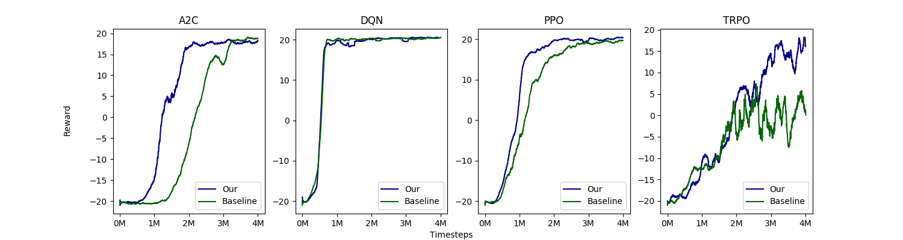
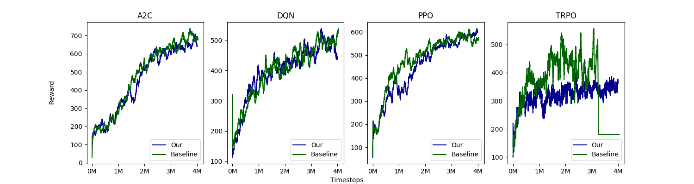
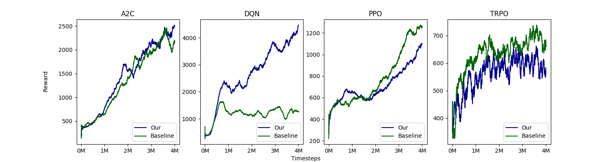
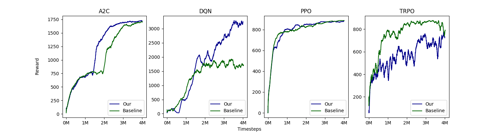

# RL-Experiments

RL-Experiments aims to modify and compare deep RL algorithms in single machine easily. 
For distributed training, I highly recommend [ray](https://github.com/ray-project/ray).

The codes refer to [openai/baselines](https://github.com/openai/baselines) mostly but 
are implemented by PyTorch. We also highlight the differences between implementation and paper 
which can be found by searching `highlight` in codes. Evaluated on 4 atari games, our implementation 
is **15%** faster than baseline with similar performance on average in single machine.


# Dependency

* Python: 3.5+
* PyTorch: 1.0.1+


# Evaluation

With the same default parameters in [openai/baselines](https://github.com/openai/baselines/commit/7bfbcf177eca8f46c0c0bfbb378e044539f5e061), 
the FPS and performance with random seed 0 on four environments are illustrated as follows. 

Devices:
* 1 NVIDIA GTX 1070
* 8 Intel(R) Core(TM) i7-7700K CPU @ 4.20GHz

### Pong

|  | A2C | DQN | PPO | TRPO|
|---|---|---|---|----|
| Our | 1667 | 277 | 1515 | 513 |
| Baselines | 1596 | 246 | 1089 | 501 |

    

### SpaceInvaders

|  | A2C | DQN | PPO | TRPO|
|---|---|---|---|----|
| Our | 1667 | 278 | 1550 | 501 |
| Baselines | 1572 | 247 | 1186 | 440 |

 

### BeamRider

|  | A2C | DQN | PPO | TRPO|
|---|---|---|---|----|
| Our | 1667 | 272 | 1515 | 494 |
| Baselines | 1543 | 243 | 1062 | 451 |

  

### Seaquest

|  | A2C | DQN | PPO | TRPO|
|---|---|---|---|----|
| Our | 1667 | 275 | 1515 | 501 |
| Baselines | 1572 | 236 | 1203 | 481 |

  


# Usage

```bash
git clone https://github.com/Officium/RL-Experiments.git
cd RL-Experiments/src
python run.py --env=CartPole-v1 --algorithm=dqn --number_timesteps=1e5
```


# Implemented algorithms

* A2C
* DQN (with double, C51, dueling, noisy and prioritized replay)
* PPO
* REINFORCE
* TRPO
